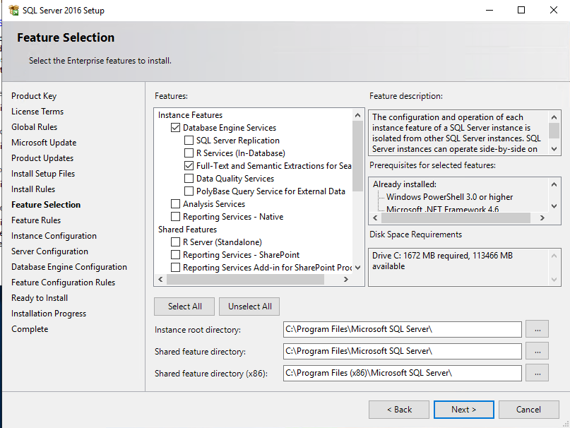
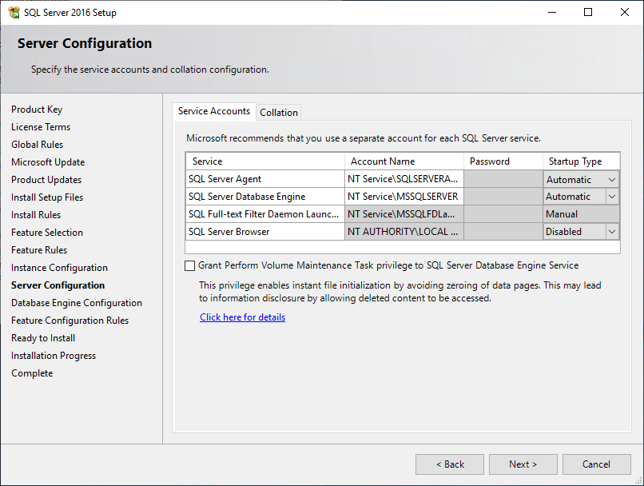
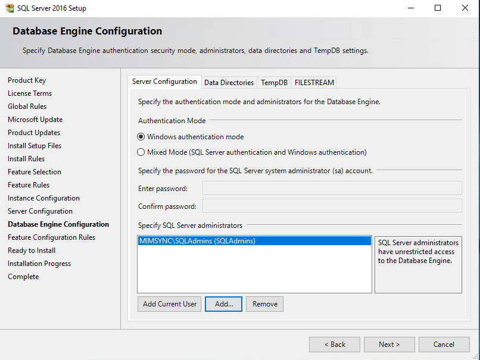

# Installing MIM for Azure AD Guest accounts and Kerberos applications

## Prerequisites
To complete this tutorial, you will need:
* a Windows 2016/2019 server
* SQL 2016/2017 installation media

## Installing SQL Server
Begin by installing .Net Framework 3.5 to support the following SQL installation. 
1. Click on **Add roles and features** on the Server Manager Dashboard
2. Click **Next** on the before you begin page, click **Next** on the Installation Type page, **Next** on the Select destination server, and next on the server roles, to end up on the Select features page. 
3. Select **.NET Framework 3.5 Features** and click **Next** and then **Install**.

Next up is the installation of the SQL server. Insert the SQL Server 2016/2017 media and run setup (Enterprise or Standard version is required).

4. Select **Installation** and then select **New SQL Server stand-alone installation...** 
5. Enter your product key, accept the license terms, select **Use Microsoft Update to check for updates** and continue clicking **Next** till the feature selection.
6. On the feature selection make sure to select:
* Database Engine Services
* Full-Text and Semantic Extractions for Search
* Client Tools Connectivity

7. Select your paths if they need to be changed and click **Next**
8. Install the database server in the default instance (MSSQLSERVER) and click **Next**
9. On the server configuration screen, set the SQL Server Agent to **Automatic** for the Startup type and click **Next**

10. On the Database Engine Configuration. Select** Windows authentication mode** and click **Add..** and add the `<servername>`\SQLAdmins group

11. If desired, click Data Directories and set alternate paths for the databases and click **Next** and finally click **Install**
12. Once the installation is finished, click **Close**

## Next: Install MIM Synchronization Service
After the installation Microsoft SQL 2016/2017 we can install the MIM synchronization service:
- [Install MIM Sync Service](install-mim-sync-service.md)