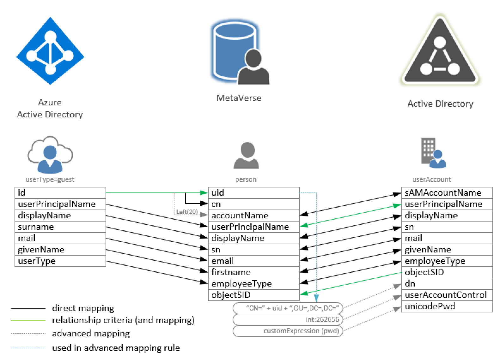

# Installing MIM for Azure AD Guest accounts and Kerberos applications

You can invite anyone to collaborate with your organization by adding them to your directory as a guest user. Then you can either send an invitation email that contains a redemption link or send a direct link to an app you want to share. Guest users can sign in with their own work, school, or social identities. You can also publish your internal Kerberos based applications to those guest users using Kerberos Constraint Delegation functions available in Azure AD App Proxy and many 3rd party reverse-proxy services.

In this quickstart, you'll add a new guest user to Azure AD, which will then be replicated to your on-premises AD for Kerberos Constraint Delegation to work.

If you don’t have an Azure subscription, create a [free account](https://azure.microsoft.com/free/?WT.mc_id=A261C142F) before you begin.

## Scenario
The initial scenario is external user AD account lifecycle management in combination with Secure Hybrid Access. In this scenario, an organization has invited guests into their Azure AD directory, and wishes to give those guests access to on-premises Kerberos-based applications, via the Azure AD application proxy or other reverse-proxy mechanisms. The Azure AD application proxy requires each user to have their own Active Directory Domain Services (ADDS) account, for identification and delegation purposes.

## Prerequisites

To complete this tutorial, you will need:
* a virtual machine for the domain controller
* a virtual machine for the MIM server
* an Azure Active Directory with P1 or P2 licenses

## Overview

The following components are part of the total solution described in this step-by-step guide.

-	An Azure AD with users and B2B guest users
-	A MIM server that synchronizes the B2B users to a local AD
-	A local Active Directory
-	A web server hosting a web page with Kerberos authentication enabled
-	An Azure AD proxy connector server
> [!TIP]
The MIM server installation is specifically for usage on a single server without MIM password portals and registration pages. This installation described here is suitable for non-highly available environments and low-object usage scenarios.

## Architecture

In order to allow Kerberos authentication to AD backend services an account will need to exist in AD. As guest users in Azure AD do not replicate back to Active Directory domains through Azure AD Connect, another connector will need to be created.
After installation and configuration, MIM will read all “Guest” users from Azure Active Directory, import them into it’s metaverse and create users in Active Directory.
For this the following attribute flows will be configured:

Each user object in Azure AD has an “id” this is a guid that represents the objectID. This is being used as the ‘mv:uid’, the ‘mv:cn’ and partially used (only the first 20 characters) to create the ‘mv:accountname’. The other attributes on ‘Guest’ accounts are userPrincipalName, ‘displayName’, ‘surname’, ‘mail’, ‘givenName’ and ‘userType’. These are copied into the metaverse attributes. 

Join rules are based on aad:id<->mv:uid, meaning these attributes are used to determine if an inbound object can be matched to an existing object in the metaverse or that a new object has to be created.

To be able to determine if an account has already been created on Active Directory, an import from AD into the metaverse will also be required. The equivalent attributes to the metaverse attributes are imported from AD and matched to the objects in the metaverse. The import join rule is based on objectSID (as this is unique).

On export to AD, the attributes are mapped 1:1, with the exception of 3 initial outbound flow attributes: ad:dn, ad:userAccountControl, dn:unicodePWD. These are only activated on the initial creation of the object and are used to: 
> - ad:dn -> set the distinguishedName of the object (and thus OU location)
> - ad:userAccountControl -> enforce smartcard logon only (to avoid users logging in with username/password)
> - ad:unicodePWD -> set a password for the user

Once users are created, their objects can be used in Kerberos Constraint Delegation (with Protocol Transition) architectures. For example, by using the Azure AD Application Proxy, guest users can now login to IIS (Kerberos) based websites on-premises.

For more information, see https://docs.microsoft.com/en-us/azure/active-directory/manage-apps/application-proxy-configure-single-sign-on-with-kcd
## First: Prepare Azure AD Graph API Access
- [Azure AD Graph API Access](prepare-azure-ad-for-GraphAPI.md)

## Next: Prepare a domain
MIM works with Active Directory (AD), so follow these steps to configure your AD domain controller.
- [Domain setup](preparedomain.md)

## Next: Install Microsoft Identity Manager 2016 components
Once your domain is in place and configured, prepare your corporate identity management server. There are two versions for implementing the workflows in MIM. The first is using the MIM portal to setup the synchronization rules, the second uses an Extension DLL for the Synchronization Service and thus the portal is not required.
The initial setup however, is the same for both:

- [Windows Server 2019](prepare-server-ws-2019.md)
- [SQL Server 2016/2017](Install-SQL-server.md)
- [MIM Synchronization Service](install-mim-sync-service.md)
- [MIM Extending MetaVerse](extending-mv-schema.md)

## (option 1) using the MIM Portal 
- [The MIM synchronization MA](installing-MimMa.md)
- [The Active Directory MA](installing-ADMA.md)
- [The Graph API MA](installing-GraphAPIMA.md)
- [SharePoint 2016](installing-sharepoint-2016.md)
- [MIM Portal](install-mim-portal.md)
- [Synchronization Rule 1: Import Guest User from Azure Active Directory](rule1-import-from-aad.md)
- [Synchronization Rule 2: Import Active Directory Guest users](rule2-import-from-ad.md)
- [Synchronization Rule 3: Create Guest User account in Active Directory](rule3-export-to-ad.md)
- [Configuring Run Profiles](configuring-MA-runprofiles.md)

## (option 2) using the Extension DLL
- [The Extension DLL](extension-dll.md)
- [The Active Directory MA with DLL](installing-ADMA-dll-version.md)
- [The Graph API MA with DLL](installing-GraphAPIMA-dll.md)
- [Configuring Run Profiles](configuring-MA-runprofiles-dll.md)

## Finally: Configure the synchonization rules
Once you have set up the domain and server, you're ready to install the MIM components and configure them to sync with AD.

- [Scheduling AutoRuns](schedule-sync-runs.md)
