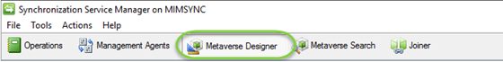
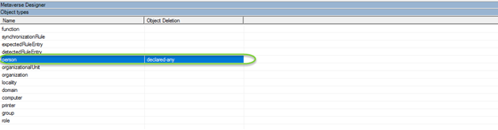
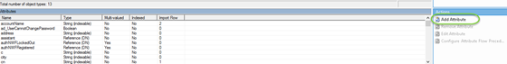
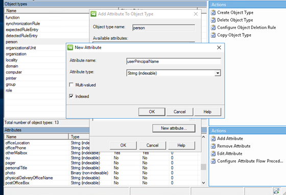

# Extending the metaverse schema 
The Azure AD Guest account configuration will use an attributed called userPrincipalName. This must be created in the metaverse prior to creating the Management Agents
1. Open the Synchronization Service Manager application from the start menu
2. In the Synchronization client, select **Metaverse Designer**

3. Then Select the **Person** Object Type

4. Next under actions click **Add Attribute** then **New attribute**

  
5. Then complete the following details
* Attribute name: **userPrincipalName**
* Attribute Type: **String (Indexable)**
* Indexed = **True**

 

6. Click **OK** to add
7. Close the Synchronization Service Manager

## Next: Install MIM portal
As the rules will be created using the MIM portal, this will need to be installed. This includes:
- [Installing SharePoint 2016](installing-sharepoint-2016.md)
- [Installing Microsoft Identity Manager Portal](install-mim-portal.md)
