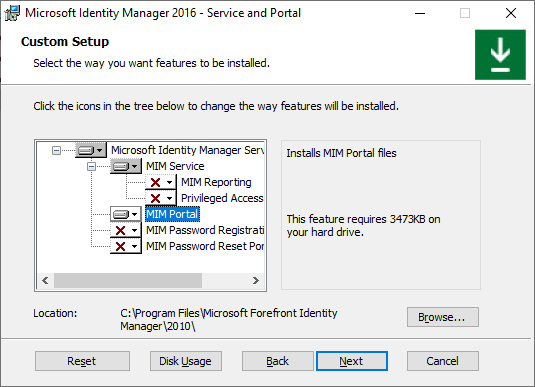
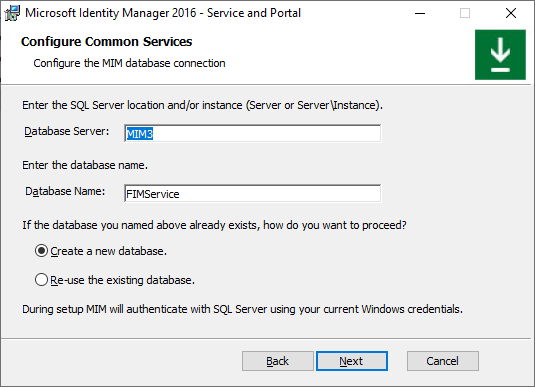
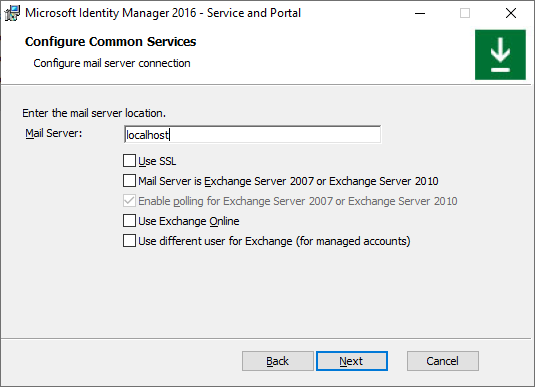
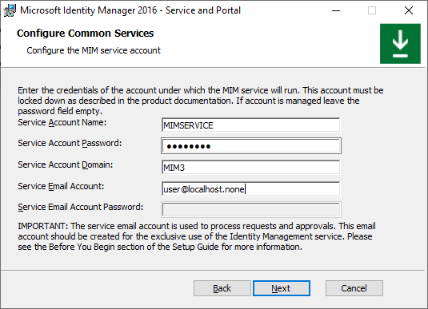
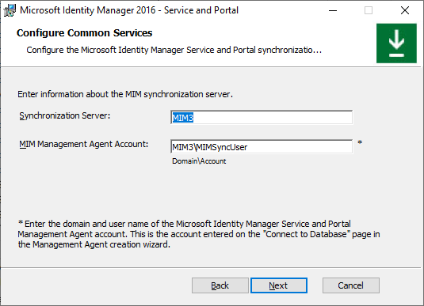
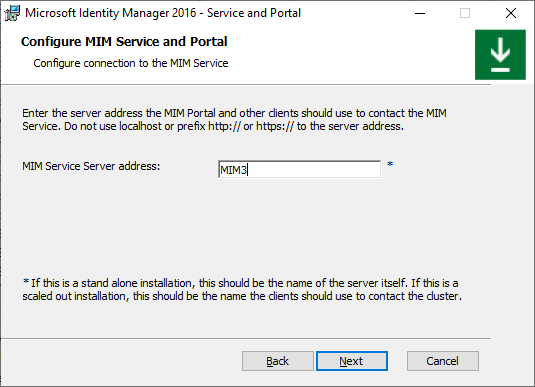
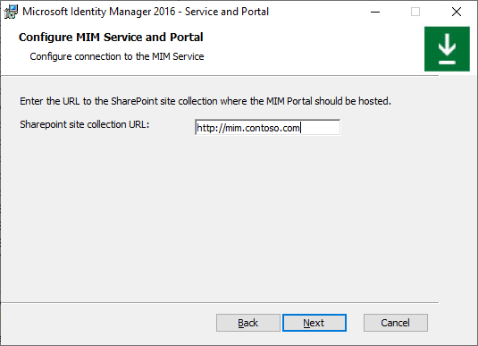
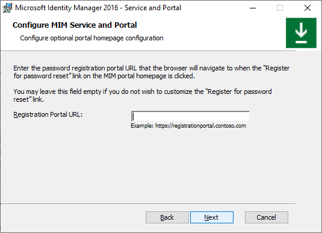
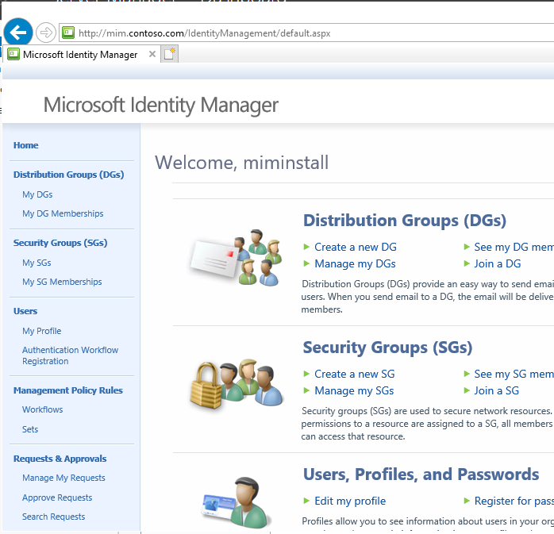

# Setup MIM for AAD Guest Accounts - SharePoint 2016 Portal

## Prerequisits
Microsoft Identity Manager has its own portal to manage advance attribute flows. This chapter will install the MIM portal.

You should have completed the following steps already:
- [Domain setup](preparedomain.md)
- [Windows Server 2019 preparations](prepare-server-ws-2019.md)
- [SQL Server 2016/2017 setup](install-SQL-server.md)
- [SharePoint 2016 setup](prepare-server-sharepoint.md)
- [MIM Synchronization Service](install-mim-sync-service.md)

> [!NOTE]
> This walkthrough uses sample names and values from a company called Contoso. Replace these with your own. For example:
> - Domain name - **contoso**
> - Password - **Pass@word1**
> - Server Name - **MIM3**
> - SharePoint URL - **http://mim.contoso.com**
> - Service Account - **MIMSERVICE**
> - Sync Service Account - **MIMSyncUser**

## Installing MIM Portal
1. Insert the Microsoft Identity Manager 2016 (with SP2) media
2. From the wizard select Install Service and Portal
- Or run `<drive>`:\Service and Portal\setup.exe from the Media
3. Click **Next** on the welcome screen
4. Accept the license terms and click **Next**
5. From the installation selection, **remove** _MIM Password Registration Portal_ and _MIM Password Reset Portal_ and click **Next**

4. On the Database server page, leave the default of local server and leave the default Database name of FIMService. Make sure **Create a new database** is selected and click **Next**

5. On the Configure Common Services page, for the mail server use **localhost** 
_(we do not send email in this configuration) and remove the checkboxes for Use SSL and Mail Server is Exchange Server 2007 or Exchange 2010 and click Next_

6. Select _Generate a new self-issued certificate _and click **Next**

7. For the Service Account Name, type MIMSERVICE and its password, for the domain, type the `<servername>` and type a non-existent email address and click **Next**

_If you receive a warning Service Account is not secure in its current configuration, click **Next**_

9. For the synchronization server, type the `<Servername>` and for the user, type `<ServerName>`\MimSyncUser

7. For the MIM Service and Portal, type `<ServerName>` and click **Next**

8. For the SharePoint Site Collection URL, type _http://mim.contoso.com_ and click **Next**

9. On the "SharePoint Timer" warning page, select **Next**
 
10.	Leave the registration portal URL blank and click **Next**

11.	On the firewall page, leave the defaults and click **Next**
 
12.	On the MIM Password portals, leave all default (blank) and click **Next**

13.	When ready to install, click **Install**
 
14.	After the installation completes, browse to http://mim.contoso.com/identitymanagement on the server (note that the loading might take a while)

This completes the installation of the MIM Portal

## Next: Installing Management Agents - MIM Synchronization MA
In total, 3 Management Agents will be installed:
- [The MIM synchronization MA](installing-MimMa.md) – to import the rules into the synchronization service
- [The Active Directory MA](installing-ADMA.md) – to create / manage the B2B accounts in the Active Directory Domain
- [The Graph API MA](installing-GraphAPIMA.md) – to read the Guest account details in Azure AD
