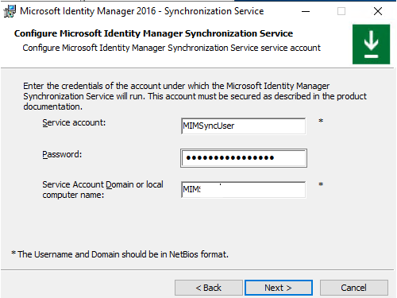

# Setup MIM for AAD Guest Accounts - MIM Synchronization Service
Microsoft Identity Manager includes an advanced Synchronization Service engine. This chapter will install this service.

You should have completed the following steps already:
- [Domain setup](preparedomain.md)
- [Windows Server 2019 preparations](prepare-server-ws-2019.md)
- [SQL Server 2016/2017 setup](install-SQL-server.md)

> [!NOTE]
> This walkthrough uses sample names and values from a company called Contoso. Replace these with your own. For example:
> - Domain name - **contoso**
> - Password - **Pass@word1**
> - Server Name - **MIM3**
> - Installation Account - **contoso\MIMInstall**
> - Service Account - **MIMSyncUser**

## Installing MIM Sync Service
MIM consists of several components, the first component to install is the Synchronization Service.
1. Log-off from the server and login with the CONTOSO\MIMInstall account created earlier
2. Insert the Microsoft Identity Manager 2016 with SP2 in the DVD and run the following installation program: `<drive>`:\Synchronization Service\Synchronization Service.msi (with admin privileges – or start setup.exe)
3. Click **Next** on the welcome screen, accept the license terms and click **Next** and on the custom setup, click **Next** as well.
4. On the SQL configuration select **This computer** and **The Default Instance** (if you receive an error about the SQL not being found, make sure the installing user is a member of the local SQLAdmins group – and you have logged off – on again to make that group membership active).

5. Select **Next** on the Database Name – accepting the default of FIMSynchronizationService
6. On the service account, type the name of the pre-created MIMSyncUser Account and type the `<ServerName>` for the computer on which you are installing:

7. On the group configuration window, leave the defaults and click **Next**

8. On the Enable firewall rules for inbound RPC communications leave the checkbox unselected and click **Next** and then click **Install**.
9. After the installation click **OK** to save the encryption key set on a location, type a name and click **Save**.

10. After the installation click **Finish**.
11. If requested to log-off, do so and login again.

## Next: Extend the metaverse schema
The synchronization rules will use the userPrincipalName attribute which by default does not exist in the metaverse schema.
- [Extending the metaverse with userPrincipalName](extending-mv-schema.md)