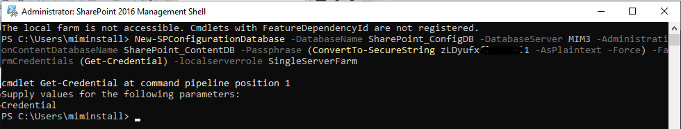
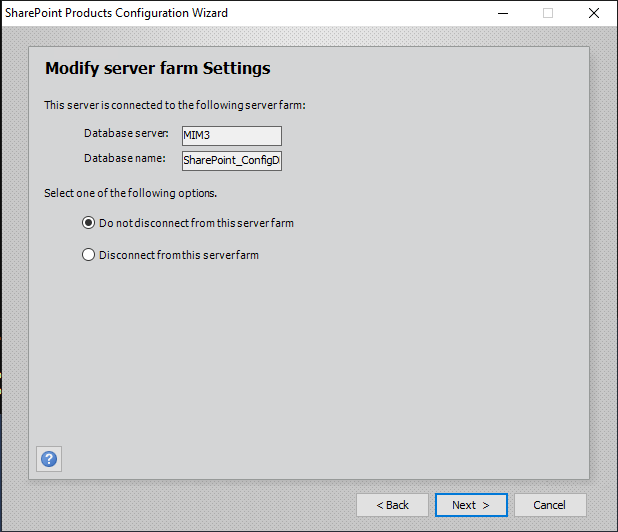
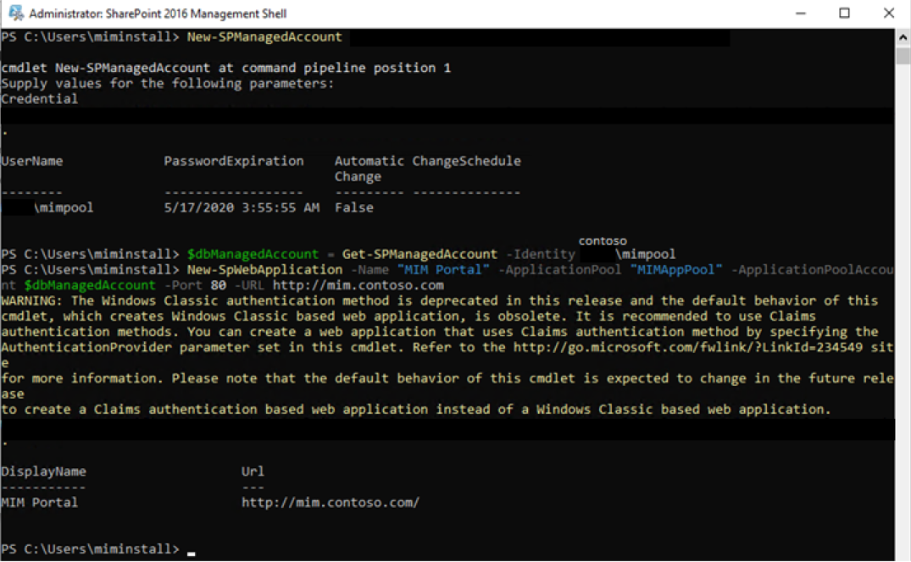
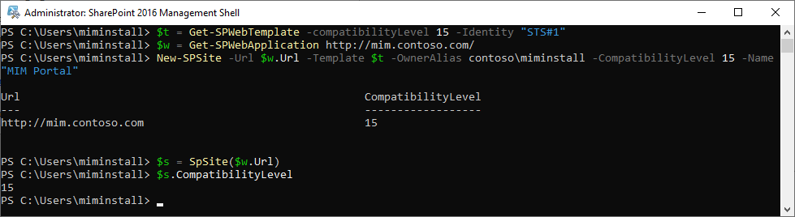
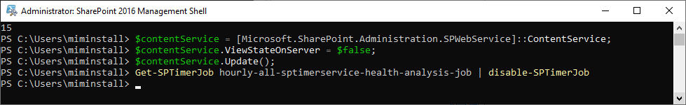
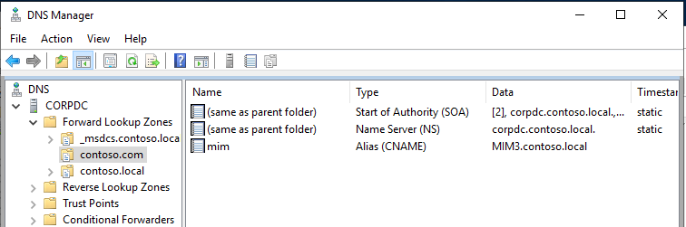
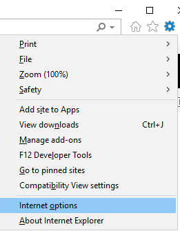
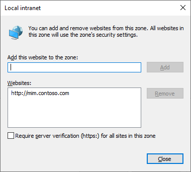

# Setup MIM for AAD Guest Accounts - SharePoint 2016 Portal

You should have completed the following steps already:
- [Domain setup](preparedomain.md)
- [Windows Server 2019 preparations](prepare-server-ws-2019.md)
- [SQL Server 2016/2017 setup](install-SQL-server.md)

> [!NOTE]
> This walkthrough uses sample names and values from a company called Contoso. Replace these with your own. For example:
> - Domain name - **contoso**
> - Password - **Pass@word1**
> - Server Name - **MIM3**
> - SharePoint URL - **http://mim.contoso.com**
> - Service Account - **SharePoint**
> - App Service Account - **contoso\MIMAppPool**

## Install **SharePoint 2016**

> [!NOTE]
> The installer requires an Internet connection to download its prerequisites. If the computer is on a virtual network which does not provide Internet connectivity, add an additional network interface to the computer that provides a connection to the Internet. This can be disabled after installation is completed.

Follow these steps to install SharePoint Server 2016. After you finish installation, the server will restart.

1. Logon with the MIMInstall account to the server and insert the SharePoint 2016 installation media
> [!TIP]If you are mounting an ISO image inside the VM, copy the installation files to a local directory and run the installer from that location.


2. Launch **PowerShell** as a domain administrator.

    -   Change to the directory of the SharePoint installation media.

    -   Type the following command.

        ```
        .\prerequisiteinstaller.exe
        ```

3. After **SharePoint** prerequisites are installed, install **SharePoint Server 2016** by typing the following command:

    ```
    .\setup.exe
    ```

4. Select the complete server type.

5. After the installation completes, **de-select** the _Run the SharePoint Products Configuration Wizard Now_ and click **Close**

6. From the start menu, run the **SharePoint 2016 Management Shell** as administrator (right click, run as administrator)
7. Change the value for `<password>` and `<servername>` for the actual values and run the following command.

> [!TIP] The `<password>` can be any password like phrase to secure the database contents
```powershell
New-SPConfigurationDatabase -DatabaseName SharePoint_ConfigDB -DatabaseServer <ServerName> -AdministrationContentDatabaseName SharePoint_ContentDB -Passphrase (ConvertTo-SecureString <password> -AsPlaintext -Force) -FarmCredentials (Get-Credential) -localserverrole SingleServerFarm
```


8. When prompted for a username and password, type the `<servername>`\SHAREPOINT username and password and wait for the command to complete (this will take a while)
9. From the start menu, start the **SharePoint Products Configuration Wizard**
11.	On the Welcome to SharePoint products page, click **Next**
12.	A warning pop-up page will be shown to warn about restarting services, click **Yes**
13.	Leave the default settings on the _Modify server farm settings_ page and click **Next**


14.	On the _Configure SharePoint Central Administrator Web Application_, leave the defaults (no port specified and NTLM) and click **Next**
15.	On the completing the SharePoint Products Configuration Wizard review the information and click **Next**
 
16.	And close the wizard after the configuration has completed

17.	In the SharePoint 2016 Management Shell (PowerShell) window, paste the following:
```powershell
New-SPManagedAccount ##Will prompt for new account enter <DOMAIN>\mimpool 
$dbManagedAccount = Get-SPManagedAccount -Identity <DOMAIN>\mimpool

New-SpWebApplication -Name "MIM Portal" -ApplicationPool "MIMAppPool" -ApplicationPoolAccount $dbManagedAccount -Port 80 -URL http://mim.contoso.com -AuthenticationMethod Kerberos
```

_Note **-AuthenticationMode Kerberos** is not displayed but should be added_

18.	Next, run the following commands to set the compatibility level for the created website: 
```powershell
$t = Get-SPWebTemplate -compatibilityLevel 15 -Identity "STS#1"
$w = Get-SPWebApplication http://mim.contoso.com/
New-SPSite -Url $w.Url -Template $t -OwnerAlias contoso\miminstall -CompatibilityLevel 15 -Name "MIM Portal"
$s = SpSite($w.Url)
$s.CompatibilityLevel
```


19.	And next, run the following commands to prepare the web app for the MIM portal installation and disable the hourly timer
```powershell
$contentService = [Microsoft.SharePoint.Administration.SPWebService]::ContentService;
$contentService.ViewStateOnServer = $false;
$contentService.Update();
Get-SPTimerJob hourly-all-sptimerservice-health-analysis-job | disable-SPTimerJob
```


## DNS / HOSTS file changes
After completing the installation and configuration of SharePoint 2016 you should have a web portal running under the specified URL: http://mim.contoso.com which systems will need to be able to find. There are two ways to achieve this:

1. If you only want to control MIM through the local server, open the hosts file by
- Open notepad in administrative mode
- Open c:\windows\system32\drivers\etc\hosts
- Add a line: 127.0.0.1 mim.contoso.com
- Save the file
2. If you want the MIM portal to be available in the domain, add mim.contoso.com as a CNAME in your DNS and point it to the MIM server A record. 


## Adding the portal to trusted sites
The portal will use Windows Integrated Authentication - including Kerberos. The portal URL will need to be added to the Internet Security Options to allow the browser to send credentials automatically:
1.	Open a browser on the local machine and go to **Tools->Internet Options**


2. Select the **Security** tab and there select the **Local Intranet** option and click **Sites**. In the pop-up, select **Advanced**
3. Type http://mim.contoso.com and click **Add** (if required deselect Require server verification (https;) for all sites) and click **Close**



4. Click **OK** several times to close the Internet Options window.
5. In the browser, go to _http://mim.contoso.com_ a default SharePoint website should appear
6. If the website does not yet appear, reboot the server and wait for some time before trying again.

## Next: Install MIM Portal
After the installation of SharePoint 2016 we can continue with the installation of the MIM portal:
- [Install MIM Portal](install-mim-portal.md)