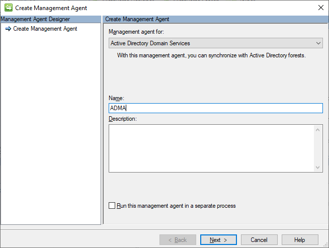
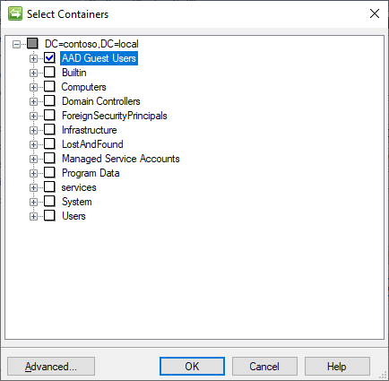
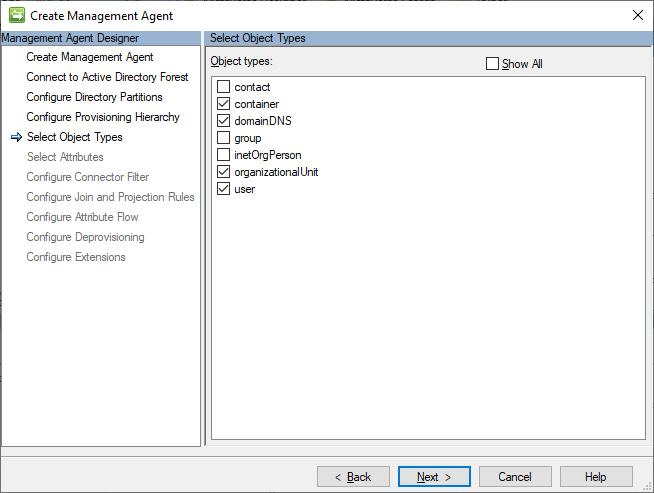
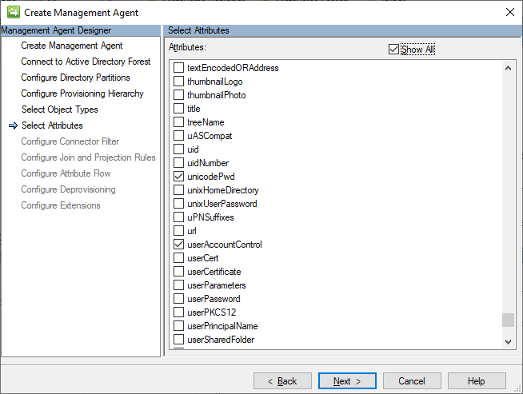

# Setup MIM for AAD Guest Accounts (option 1) - Installing Active Directory MA

## Prerequisits
This chapter will install the Active Directory Management Agent to import the AD (user) objects into the metaverse and to create new users in AD:

You should have completed the following steps already:

- [Domain setup](preparedomain.md)
- [Windows Server 2019 preparations](prepare-server-ws-2019.md)
- [SQL Server 2016/2017 setup](install-SQL-server.md)
- [MIM Synchronization Service](install-mim-sync-service.md)
- [SharePoint 2016 setup](prepare-server-sharepoint.md)
- [MIM Portal Service](install-mim-portal.md)

> [!NOTE]
> This walkthrough uses sample names and values from a company called Contoso. Replace these with your own. For example:
> - Domain name - **contoso**
> - Password - **Pass@word1**
> - Service Account - **MIMMA**
> - Directory Partitions - **DC=CONTOSO, DC=local**
> - AD Guest OU - **AAD Guest Users**

## Active Directory MA
The Active Directory management agent is a connector for AD Domain Services. To create this connector, you use the Create Management Agent wizard in the Synchronization Service:

1. To open the _Create Management Agent wizard_, in the Synchronization Service Console on the Actions menu under Management Agents, click **Create**

2. On the _Create Management Agent_ page, provide the following settings, and then click **Next**:
- Management agent for: **Active Directory Domain Services**
- Name: **ADMA**

3. On the Connect to Active Directory Forest page, provide the following settings, and then click **Next**:
> - Forest name: **contoso.local**
> - User name: **MIMMA**
> - Password : `<the account’s password>`
> - Domain: **Contoso**

4. On the Configure Directory Partitions page, provide the following settings, and then click **Next**:
> - In the **Select directory partitions** list, select `"DC=CONTOSO, DC=local"`
> - click **Containers**
> - Select only the `"AAD Guest Users"` OU
> - To close the _Select Containers_ dialog box, click **OK**

5. On the _Configure Provisioning Hierarchy_ page, click **Next**

6. On the _Select Object Types_ page, provide the following settings, and then click **Next**:
> - In the Object types list, select **user**, next to the existing selections

7.	On the Select Attributes page, check Show ALL, elect the following attributes, and then click **Next**:
> - company
> - displayName
> - employeeType
> - givenName
> - objectSid
> - sAMAccountName
> - sn
> - unicodePwd
> - userAccountControl

8. On the _Configure Connector Filter_ page, click **Next**
9. On the _Configure Join and Projection Rules_ page, click **Next**
10. On the _Configure Attribute Flow_ page, click **Next**
11. On the _Configure Deprovisioning_ page, click **Next**
12.	On the _Configure Extensions_ page, click **Finish**

## Next: Installing Management Agents - Graph API MA
In total, 3 Management Agents will be installed:
- [The Graph API MA](installing-GraphAPIMA.md) – to read the Guest account details in Azure AD

> - [The MIM synchronization MA](installing-MimMa.md) – to import the rules into the synchronization service
> - [The Active Directory MA](installing-ADMA.md) – to create / manage the B2B accounts in the Active Directory Domain