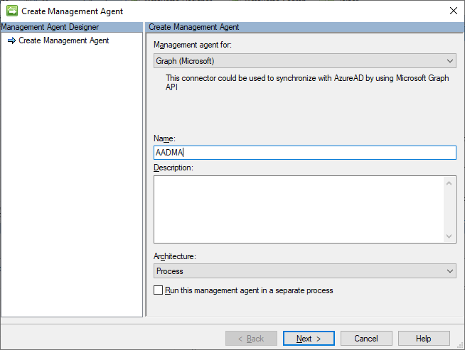
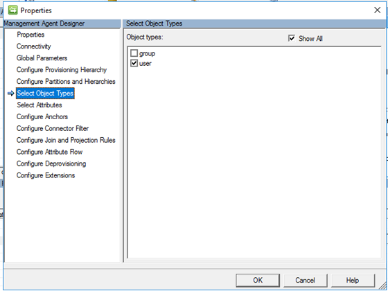
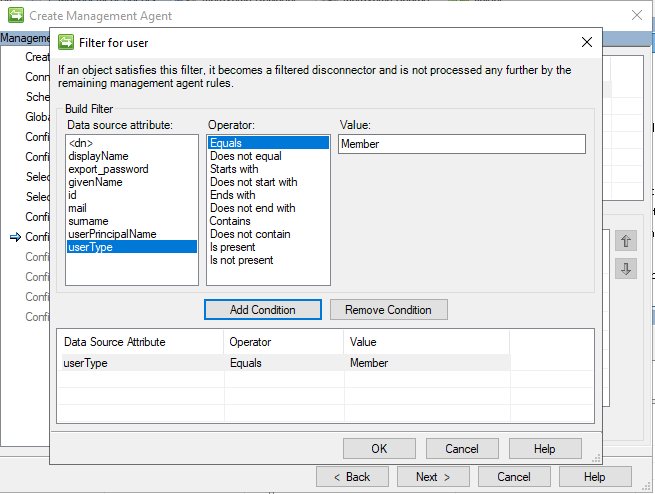

# Setup MIM for AAD Guest Accounts - Active Directory MA with DLL

## Prerequisits
This chapter will install the Active Directory Management Agent to import the AD (user) objects into the metaverse and to create new users in AD and will use the Extension DLL for the advanced attribute flows:

You should have completed the following steps already:

- [Domain setup](preparedomain.md)
- [Windows Server 2019 preparations](prepare-server-ws-2019.md)
- [SQL Server 2016/2017 setup](install-SQL-server.md)
- [MIM Synchronization Service](install-mim-sync-service.md)

> [!NOTE]
> This walkthrough uses sample names and values from a company called Contoso. Replace these with your own. For example:
> - Domain name - **contoso**
> - Password - **Pass@word1**
> - Service Account - **MIMMA**
> - Directory Partitions - **DC=CONTOSO, DC=local**
> - AD Guest OU - **OU=AAD Guest Users**

## Installing the GraphAPI Management Agent
In order to read the users from Azure AD, we need to install the Graph Connector. This connector can be downloaded from: http://go.microsoft.com/fwlink/?LinkId=717495
1. Start the installation, click **Next** on the _Welcome screen_ 
2. Accept the license agreement and click **Install** 
3. After the installation, go to **start** and type **services** and open the service management console 
4. Under the services window find the **Forefront Identity Manager Synchronization Service** right click and select **Restart** 

## Create the New Management Agent 
1. In the _Synchronization Service Manager_ UI, select **Connectors** and **Create**. Select **Graph (Microsoft)** and give it a descriptive name (AADMA) 

2. On the _Connectivity_ page, you must specify the Graph API Version. Select the **v1.0** version and click **Next**

> [!TIP]_Production ready API is V 1.0, Non-Production is Beta_

3. In the _Global Parameters_ page, leave the defaults and click **Next**

4.	On the _Configure Provision Hierarchy_ leave the defaults and click **Next**

5. On the _Partitions and hierarchies_ page, select **default** and click **Next** 

6. On the _Object types_ page, select **user** and click **Next**

7. On the _Select Attributes_ screen, select the following attributes and click **Next**

> - displayName
> - id
> - mail
> - givenName
> - surName
> - userPrincipalName
> - userType

8. On the _Configure Anchor_ screen, leave the defaults and click **Next**

_MIM allows you to filter out objects based on an attribute filter. In this scenario we will filter out all users that have userType=member set in their profile as we only want to import users that have userType=Guest._

9. On the _Configure Connector Filter_ page, add a filter with the following conditions:
- Select **user** in the Data Source Object Type window and click **New**
> - Click **Add condition** with the following details:
> - > Data source attribute: **userType**
> - > Operator: **Equals**
> - > Value: **Member**
- click **Next** after adding the condition  

10.	On the _Join and Projection rules_ page click **user** in the _data source object_ type and then click **New Join Rule**
> - Select **id** as the _data source attribute_
> - Set the _mapping type_ to **Direct**
> - Set **uid** as the _metaverse object type_
> - Click **Add Condition**
> - Click **New Projection Rule**
> - Select **Declared** and select **person** as the _Metaverse Object Type_

10.	Click **Next** to go to the attribute flow page

11.	On the _attribute flow_ page, create rules for all attributes listed below by:
> - select **user** as the _Data source object_ type
> - select **person** as the _metaverse object_ type
> - select **Import** as the _flow direction_
> - select **Direct** as the _mapping type_

> |Data source attribute | Metaverse attribute |
> |----------------------|:--------------------:
> |displayName | displayName |
> |userType | employeeType |
> |givenName | firstName |
> |mail | email |
> |userPrincipalName | userPrincipalName |
> |id | uid |
> |surname | sn |

12.	A static value will also be required for the destination OU for this: 
> - Select _Object Type_: **user** in the top column
> - Select **user** as the _data source object_ type in the build attribute flow
> - Select **ou** as the Data source attribute
> - Select **Advanced** as the mapping type
> - Select **Import** as the Direction
> - Set the _Metaverse object_ type to **person**
> - Select **Street** as the _Metaverse Attribute_
> - Click **New**
> - In the pop-up, select the **Constant** check box
> - Paste the value of the **dn** of the target OU (OU=AAD Guest Users,DC=Contoso,DC=local)
> - Click **OK** to close

13.	A custom extension will be required for the accountName value, for this:
> - Select _Object Type_: **user** in the top column
> - Select **user** as the _data source object type_ in the build attribute flow
> - Select **id** as the _Data source attribute_
> - Select **Advanced** as the _mapping type_
> - Select **Import** as the _Direction_
> - Set the _Metaverse object type_ to **person**
> - Select **accountName** as the _Metaverse Attribute_
> - Click **New**
> - Select _Rules extension_ and type **cd.user:id->mv.person:accountName**
> - Click **OK**

14.	Click **Next** to go to the Deprovisioning page, keep the defaults (**Make them disconnectors**) and click **Next**
15.	On the Configure Extensions page, click **Select**
16.	Select the **AAD-B2B-Guest-MIM-Extensions.dll** and click **OK**

17.	Click **Finish**

## Next: Creating Run Profiles for the Management Agents
The 2 Management Agents have been added now, but each of them needs to have a "run profile" where an import, synchronization or export is created.
- [Creating Run Profiles for DLL](configuring-MA-runprofiles.md)