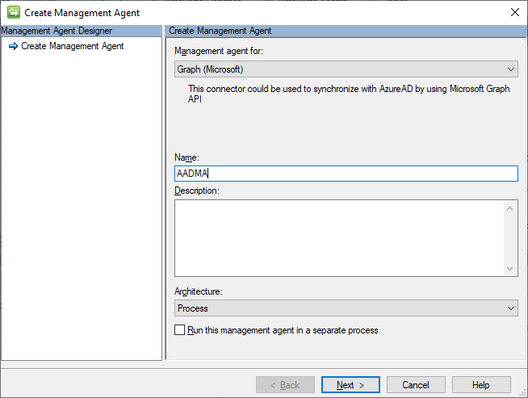
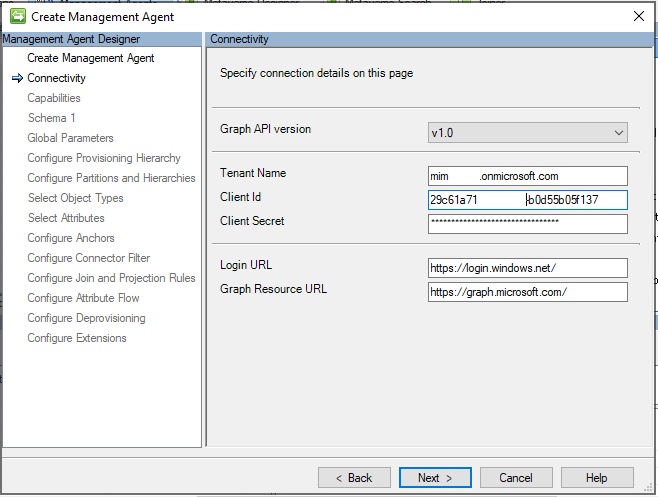
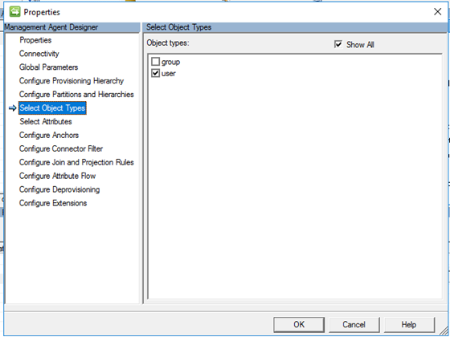
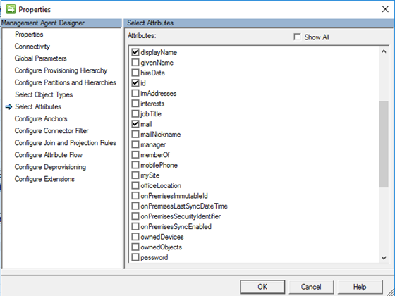
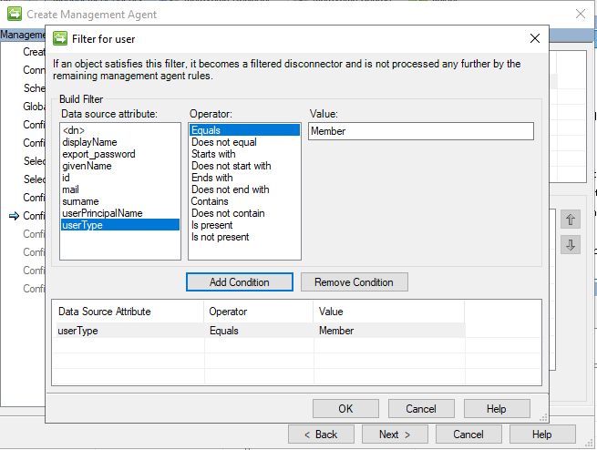

# Setup MIM for AAD Guest Accounts (option 1) - Installing GraphAPI MA

## Prerequisits
This chapter will install the GraphAPI Agent to import guest users from Azure AD:

You should have completed the following steps already:

- [Windows Server 2019 preparations](prepare-server-ws-2019.md)
- [SQL Server 2016/2017 setup](install-SQL-server.md)
- [MIM Synchronization Service](install-mim-sync-service.md)
- [Azure AD Graph API Access](prepare-azure-ad-for-GraphAPI.md)

## Installing the GraphAPI Management Agent
In order to read the users from Azure AD, we need to install the Graph Connector. This connector can be downloaded from: http://go.microsoft.com/fwlink/?LinkId=717495
1. Start the installation, click **Next** on the _Welcome screen_ 
2. Accept the license agreement and click **Install** 
3. After the installation, go to **start** and type **services** and open the service management console 
4. Under the services window find the **Forefront Identity Manager Synchronization Service** right click and select **Restart** 

## Create the New Management Agent 
1. In the _Synchronization Service Manager_ UI, select **Connectors** and **Create**. Select **Graph (Microsoft)** and give it a descriptive name (AADMA) 

2. On the _Connectivity_ page, you must specify the Graph API Version. Select the **v1.0** version and click **Next**

> [!TIP]_Production ready API is V 1.0, Non-Production is Beta_

3. In the _Global Parameters_ page, leave the defaults and click **Next**

4.	On the _Configure Provision Hierarchy_ leave the defaults and click **Next**

5. On the _Partitions and hierarchies_ page, select **default** and click **Next** 

6. On the _Object types_ page, select **user** and click **Next**

7. On the _Select Attributes_ screen, select the following attributes and click **Next**

> - displayName
> - id
> - mail
> - givenName
> - surName
> - userPrincipalName
> - userType

8.	On the _Configure Anchor_ screen, leave the defaults and click **Next**

_MIM allows you to filter out objects based on an attribute filter. In this scenario we will filter out all users that have userType=member set in their profile as we only want to import users that have userType=Guest._

9. On the _Configure Connector Filter_ page, add a filter with the following conditions:
- Select **user** in the Data Source Object Type window and click **New**
> - Click **Add condition** with the following details:
> - > Data source attribute: **userType**
> - > Operator: **Equals**
> - >Value: **Member**
- click **Next** after adding the condition  

12.	On the _Join and Projection rules_ page, leave the defaults and click **Next**

13.	On the _Projection page_ leave defaults and click **Next**
 
14.	On the _Configure Deprovisioning_ page leave the default of _Make them disconnectors_ and click **Next**

15.	On the _Configure Extensions_ page, leave the defaults and click **Finish**

## Next: Creating Run Profiles for the Management Agents
The 3 Management Agents have been added now, but each of them needs to have a "run profile" where an import, synchronization or export is created.
- [Creating Run Profiles](configuring-MA-runprofiles.md)