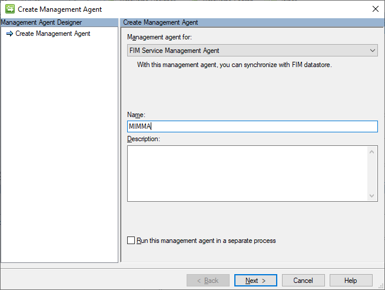
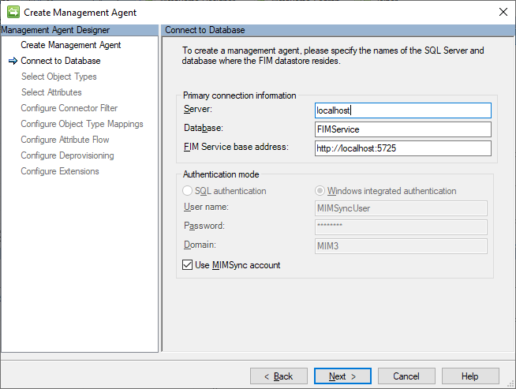
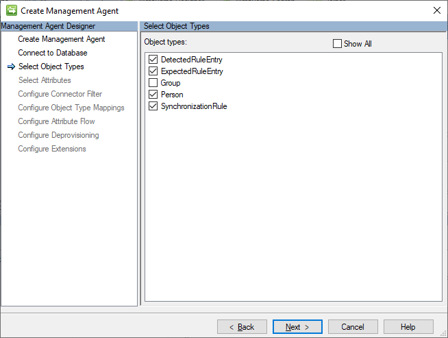
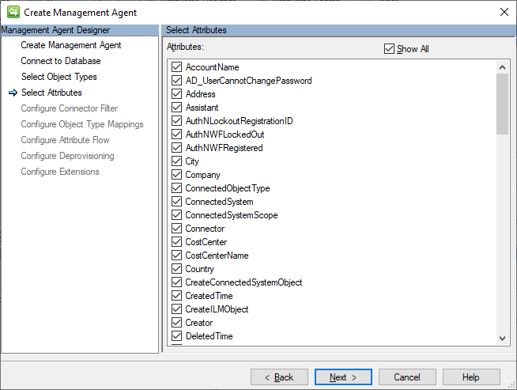

# Setup MIM for AAD Guest Accounts (option 1) - Installing MIM MA

## Prerequisits
This chapter will install the FIM/MIM Management Agent to import the flow rules configured in the portal into the Synchronization Engine. 

You should have completed the following steps already:

- [Domain setup](preparedomain.md)
- [Windows Server 2019 preparations](prepare-server-ws-2019.md)
- [SQL Server 2016/2017 setup](install-SQL-server.md)
- [MIM Synchronization Service](install-mim-sync-service.md)
- [SharePoint 2016 setup](prepare-server-sharepoint.md)
- [MIM Portal Service](install-mim-portal.md)

## MIM Synchronization MA
This chapter will install the FIM/MIM Service Management Agent for use with the MIM portal.

1. Open the Synchronization Service Manager through the start menu
2. From the top bar, select **Management Agents** and then on the right-site action menu select **Create**
3. For the Management Agent for selection, select **FIM Service Management Agent** and type a name for the MA (MIMMA) and click **Next**

4. On the _Connect to Database_ page, type the following information and click **Next**
- Server: **localhost**
- Database **FIMService**
- Mim service base address: **http://localhost:5725**
- Select the **Use MIMSync account** checkbox

5. On the _Selected Object Types_ page, make sure to have selected the following objects:
- DetectedRuleEntry
- ExpectedRuleEntry
- Person
- SynchronizationRule

6. On the _Selected Attributes_ page, click **Show All** and ensure the following additional attributes are selected and click **Next**
- AccountName
- cn
- Email
- EmployeeType
- FirstName
- LastName
- ObjectSID

7. On the _Configure Connection Filter_ Page, click **Person** and click **New**
8. Create a new filter as follows:
- Data Source attribute: **AccountName**
- Operator: **Equals**
- Value: **MIMINSTALL**
- Click **Add Condition** and click **OK**
9.	Create a new 2nd filter with the following details:
- Data Source attribute: **DisplayName**
- Operator: **Start with**
- Value: **Built-in**
- Click **Add** Condition and click **OK**

10.	On the _Configure Object Type Mappings_ page, click **Person** and select **Add Mapping**
- Set the **object mapping type** to **person** and click **OK**

11.	On the _Configure Attribute Flow_ page, click **Next**
12.	On the _Configure Deprovisioning_ page, click **Next**
13.	On the _Configure Extensions_ page, click **Finish**

## Enabling Synchronization Rule Provisioning
In order to import the rules into the synchronization service, we need to run the Management Agent for MIMMA. For this: 
1. Open Synchronization Service Manager
2. Go to **Tools** and select **Options**
3. In the options window, select **Enable Synchronization Rule Provisioning**
4. Click **OK** to close the options window

## Next: Installing Management Agents - Active Directory MA
In total, 3 Management Agents will be installed:
- [The Active Directory MA](installing-ADMA.md) – to create / manage the B2B accounts in the Active Directory Domain
- [The Graph API MA](installing-GraphAPIMA.md) – to read the Guest account details in Azure AD

> - [The MIM synchronization MA](installing-MimMa.md) – to import the rules into the synchronization service 
