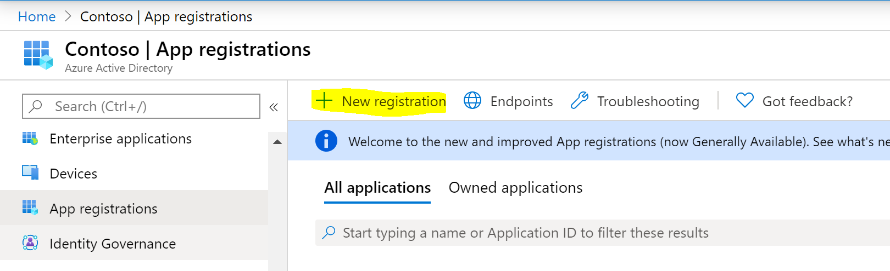
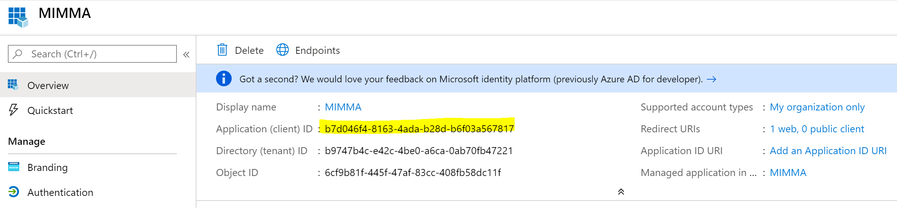
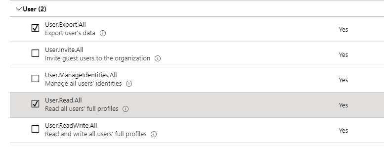
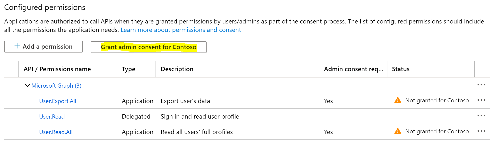
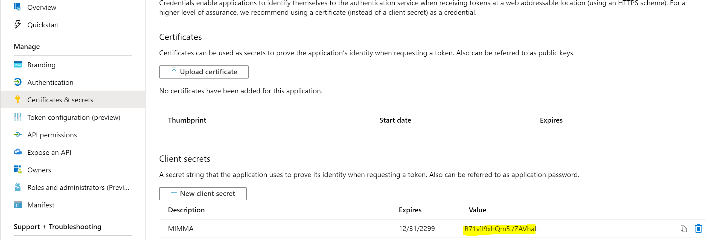
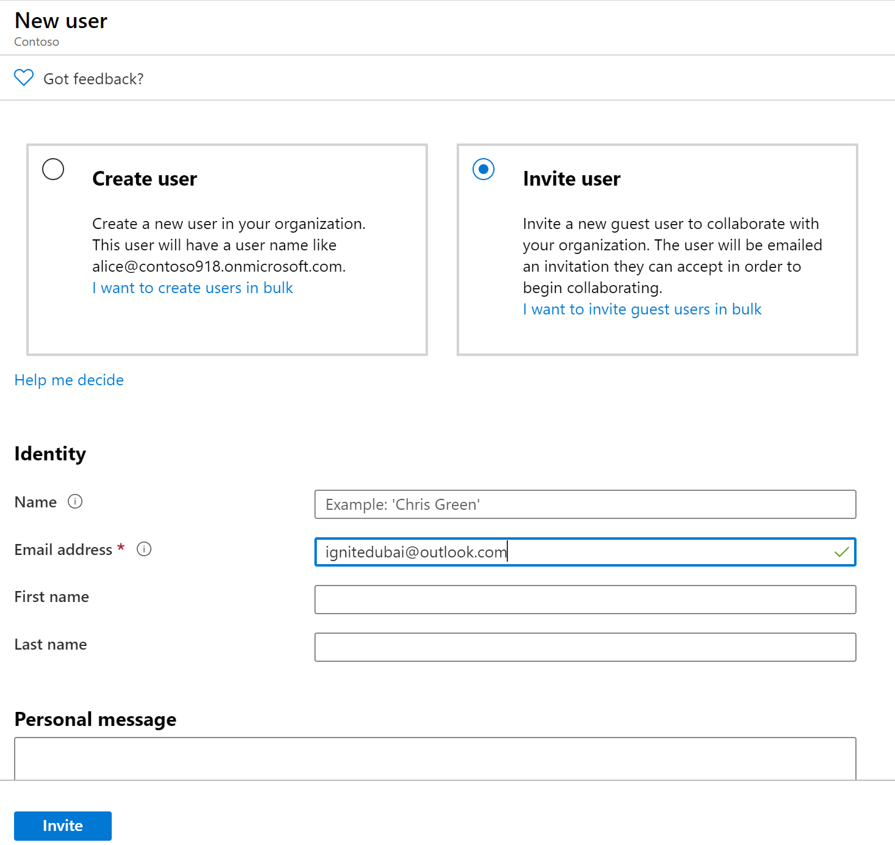

# Setup MIM for AAD Guest Accounts - Preparing Azure AD

## Prerequisits
This chapter will configure an application in Azure AD for the GraphAPI Agent to import guest users from Azure AD:
- An existing Azure AD will be required.

## Azure Active Directory tenant
In the Azure AD tenant there will be regular users and Guest users. To access these user objects through the Graph API Management Adapter in MIM, an “Application ID” will need to be created. 

1. Login to the Azure AD portal as AAD Global Admin and go to **Azure Active Directory**

2. In the Azure AD Portal, create a new application by selecting **App registrations** and click **+ New application Registration**

3. Type a name for the application (MIMMA) and set the Redirect URL to http://localhost and click **Register**
4. On the Overview page note the _Application ID_, as a Client ID to use later on the MA’s connectivity page:

5. On the left windowpane go to **API permissions** and select **+ Add a permission**. On the _Select an API window_, select **Microsoft Graph**
6. Select the **Application permissions** and scroll down to the _User permissions_ to select: **User.Export.All** and **User.Read.All** then select **Add permissions**

7. As these permissions require admin consent, login with a global AAD admin user (if not already) and click the **Grant Consent for `<AAD domain name>`**, and then click **Yes**

8. Ensure that the Status is set to _Granted for `<AAD name>`_ for the application
9. Next, click **Certificates and secrets** and then select **+ New client secret**. Provide a description (for example MIMMA) and set a period for the expiration (Never).
10.	_The value of the secret will be shown once_. Copy the value prior to deviating from the page and save it as the _ApplicationPassword_. The secret value will not be available after leaving the page.
 

## Inviting a Guest user
In order to retrieve all AAD Guest users, first make sure to invite a user into the AAD:
1. Login to Azure and select the Azure Active Directory blade
2. Select **Users** and click **New Guest User**
3. Select **Invite User** and type the email address of the invitee
4. Optionally fill in Name, First Name and Last Name
5. Add a personal message if needed and click **Invite**

## Next: Prepare the Active Directory Domain
Once your Azure AD is configured for the new application, we can commence with the actual installation, starting with the domain preparations:
- [Domain setup](preparedomain.md)
