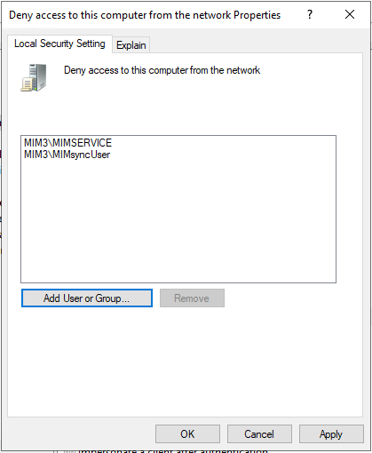

# Preparing the server
This chapter will install a basic installation of MIM and portal that allows you to configure the required flows through the MIM portal. 

> [!TIP]
This tutorial will use local accounts where possible to enhance the security of the installation and does not include Password reset portals. If you need to install a full version of MIM, please check the installation guide at: https://docs.microsoft.com/en-us/microsoft-identity-manager/microsoft-identity-manager-deploy


## Creating service accounts and groups
Prepare a Windows Server 2016/2019 (make sure to install the Desktop Experience version) and join it to the domain.

1.	Open a command-prompt (with local administrative privileges and run the following (replace `<Password>` with a self-chosen password (for each account) and `<DOMAIN>` with the Netbios name of your domain):
```
NET USER MIMSYNCUSER <Password> /ADD
NET USER MIMSERVICE <Password> /ADD
NET USER SHAREPOINT <Password> /ADD

NET LOCALGROUP SQLAdmins /ADD
NET LOCALGROUP FIMSyncAdmins /ADD
NET LOCALGROUP FIMSyncOperators /ADD
NET LOCALGROUP FIMSyncJoiners /ADD
NET LOCALGROUP FIMSyncBrowse /ADD
NET LOCALGROUP FIMSyncPasswordSet /ADD

NET LOCALGROUP FIMSyncAdmins MIMSyncUser /ADD
NET LOCALGROUP SQLAdmins MIMSyncUser /ADD
NET LOCALGROUP SQLADMINS SHAREPOINT /ADD
NET LOCALGROUP SQLADMINS <DOMAIN>\MIMINSTALL /ADD
NET LOCALGROUP ADMINISTRATORS <DOMAIN>\MIMInstall /ADD
```

## Preparing IE Enhanced Security
1.	On the server manager page, click **Configure this local server**
2.	On the properties page, click the **On** in the **IE Enhanced Security Configuration** setting
3.	Set the Internet Explorer Enhanced Security Configuration to **Off** for both Users and Administrators and click **OK**

## Securing MIM Service Accounts
1.	Go to start, type **_group policy_** and select the **Edit Group Policy**. Once the policy opens, go to **Computer Configuration\Windows Settings\Security Settings\Local Policies\User Rights Assignment**
2.	Select **Logon as a Service** click **Add User or Group** and provide the _MIMSyncUser_ account and the MimService account _(make sure to choose the local computer under Location)_
3.	Select **Deny access from this computer from the network** and click **Add user or Group** and provide the _MIMSyncUser_ and the _MimService_ account.



4. Select **Logon as Batch job** and click **Add** and provide the _MIMSyncUser_ account
5.	Run _**GPUpdate /Force**_ from the command prompt for the changes to take effect.

## Next: Install SQL Server
Once your server is configured, install Microsoft SQL 2016/2017 to support MIM:
- [Microsoft SQL Installation](Install-SQL-server.md)
