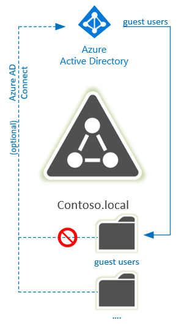
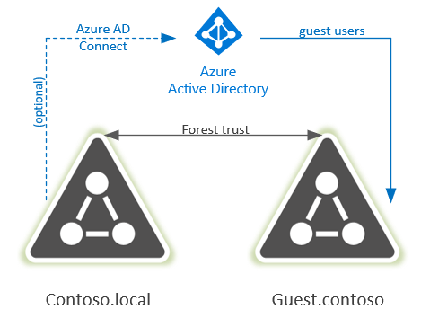
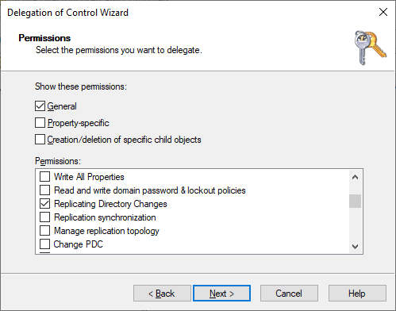
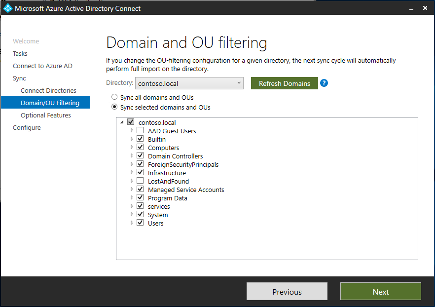

# Domain Preparations
A domain is required for the Guest accounts, this can be an existing domain or a new domain/forest with a two-way forest trust to the domain in which the Kerberos based services are located.



Guest users can be added in a single domain to a separate OU that is (if applicable) removed from the Azure AD Connect scope. This ensures that guest users aren’t replicated back to Azure AD.

It is also possible to create the guest users in a trusted domain. In this case, Azure AD Connect might have to be reconfigured as this new domain (or specific OU in that domain for the guest users) should be outside of the scope for Azure AD Connect as well.



!TIP: Using a separate forest could have advantages as selective authentication is available for the trust, allowing more control on the objects that guest users can authenticate to, but does incur more administrative overhead.
More information: https://docs.microsoft.com/en-us/windows-server/identity/ad-ds/deploy/ad-ds-deployment

> [!NOTE]
> This walkthrough uses sample names and values from a company called Contoso. Replace these with your own. For example:
> - Domain name - **contoso**
> - Service Account - **MIMMA**
> - Install Account - **MIMINSTALL**
> - SharePoint Pool Account - **MIMPOOL**
> - Portal URL - **http://mim.contoso.com**

## Domain Controller
Install a domain controller (if not already available), by installing Windows Server 2019 (or other version) and promote the server to be a domain controller. 
More information: [https://docs.microsoft.com/en-us/windows-server/identity/ad-ds/deploy/ad-ds-deployment](https://docs.microsoft.com/en-us/windows-server/identity/ad-ds/deploy/ad-ds-deployment)

## Creating Service Accounts
To install Microsoft Identity Manager a number of service accounts and groups will be required. The first account (MIMINSTALL) will be used to install MIM (and portals) and can be disabled or removed afterwards. The MIMMA account is used for the MIM Management Agent to read and create user accounts in a dedicated OU. Finally, the MIMPool account will be used to run the SharePoint website hosting the MIM administrative portal.

Run the following script and change the value for the `<password>` on a member server with ADDS-Powershell CMDlets installed (or a domain controller)

If choosing option 2 (Extension DLL) for installation, the MIMPool account and SPN registration are not required.

```powershell
$MimInstallPwd = ConvertTo-SecureString "<password>" –asplaintext –force
$MIMMAPwd = ConvertTo-SecureString "<password>" –asplaintext –force

Import-Module ActiveDirectory

#User to be used to install MIM and SharePoint
New-ADUser –SamAccountName MIMINSTALL –name MIMINSTALL
Set-ADAccountPassword –identity MIMINSTALL –NewPassword $MimInstallPwd
Set-ADUser –identity MIMINSTALL –Enabled 1 

#New user for the MIM Management agent – creating the users in AD
New-ADUser –SamAccountName MIMMA –name MIMMA
Set-ADAccountPassword –identity MIMMA –NewPassword $MIMMAPwd
Set-ADUser –identity MIMMA –Enabled 1 –PasswordNeverExpires 1

 ```
Run the following command to create the MIMPool account and set the SPN for integrated authentication to the portal website. This step is not required if choosing Option 2 (Extension DLL) for the installation:
```powershell
$MIMPoolPwd = ConvertTo-SecureString "<password>" –asplaintext –force
#New user for the SharePoint website Pool Account
New-ADUser –SamAccountName MIMpool –name MIMpool
Set-ADAccountPassword –identity MIMPool –NewPassword $MIMPoolPwd
Set-ADUser –identity MIMPool –Enabled 1 -PasswordNeverExpires 1

setspn -S http/mim.contoso.com Contoso\mimpool
```
# Domain Rights Delegation
The Guest users in Azure AD will be created in an OU in the  Active Directory Domain by MIM. Therefore you will need to use an existing OU or create a new one to host these objects.

1. Open AD Users and Computers on a domain controller or a computer with remote server tools installed
2. Create a new OU in Active Directory (eg. AAD Guest Users)
3. Right click the OU and select **Delegate control**
4. In the pop-up Welcome window click** Next** and on the next window click **Add..** and type the service account to be used by MIM to create users (MIMMA) and click** OK** and then **Next**
5. In the tasks to delegate window, select **Create, delete, and manage user accounts** and click **Next**
6. Click **Finish** to close the delegation window
7. Right click the domain name and select **Delegate** and click **Next** on the welcome screen
8. In the users and groups field, click **Add** and type the service account to be used by MIM to create users (MIMMA) and click **OK** and then **Next**
9. In the tasks to delegate window, select **Create a Custom task to delegate** and click **Next**
10. On the Active Directory Object Type window, leave the default selection of **This folder, existing object…** and click **Next**
11. On the permissions window, select **Replicating Directory Changes** and click **Next**
12. Click **Finish** to close the wizard.



## Excluding the OU from Azure AD Connect
The OU hosting Azure AD Guest objects will need to be excluded from the Azure AD Connect synchronization if in place, to avoid those accounts from being replicated back to Azure AD again.
1.	Open Azure AD Connect
2.	Click **Customize Synchronization** Settings
3.	Login to Azure AD with a global admin account
4.	On the Connect Directories page select your domain and click **Next**
5.	On the Domain and OU filtering page, select your domain, expand the selection box and **deselect the target OU** (created earlier) and click **Next**
6.	On the Optional Features page, click **Next**
7.	Click **Configure** to complete the changes
8.	Click **Exit** to close the wizard on the Configuration Complete window



## Next: Prepare MIM Server
Once your domain is in place and configured, prepare your Microsoft Identity Management server:
- [Prepare Windows Server 2016/2019 for MIM](prepare-server-ws-2019.md)