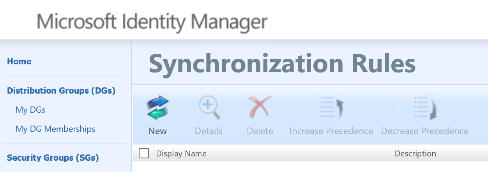
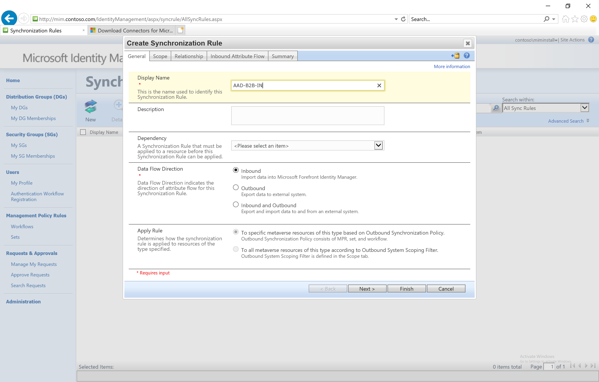
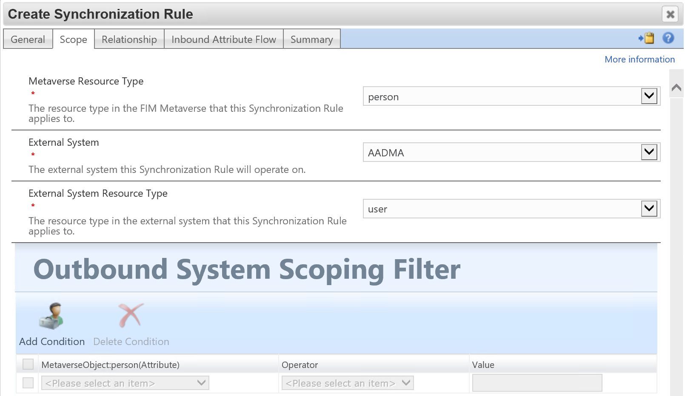
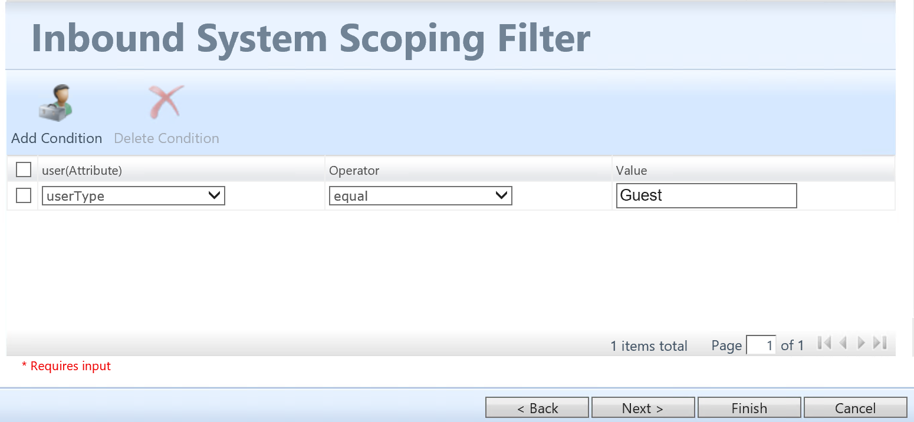
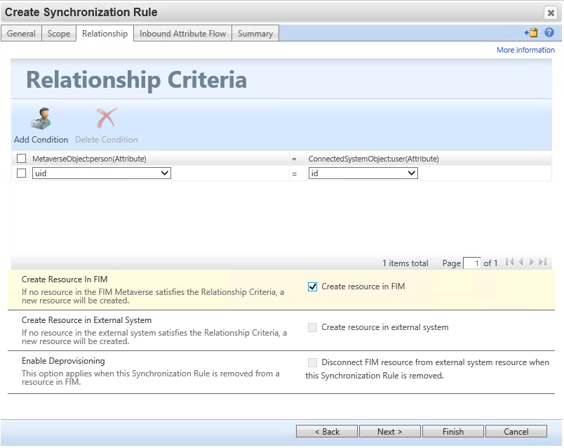
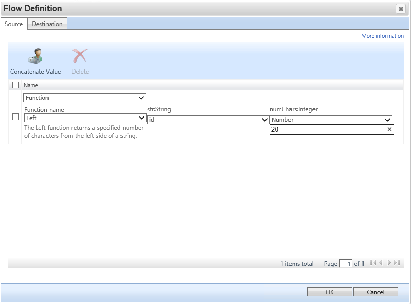
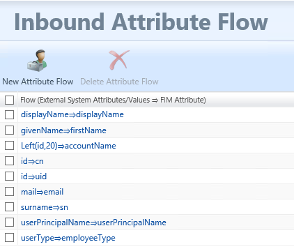

# Setup MIM for AAD Guest Accounts - Synchronization Rule 1

## Prerequisits
This chapter will create the synchronization rule for importing Azure AD Guest users.

You should have completed the following steps already:

- [Windows Server 2019 preparations](prepare-server-ws-2019.md)
- [SQL Server 2016/2017 setup](install-SQL-server.md)
- [MIM Synchronization Service](install-mim-sync-service.md)
- [The MIM synchronization MA](installing-MimMa.md) 
- [SharePoint](prepare-server-sharepoint.md)
- [MIM Service and Portal](install-mim-service-portal.md)
- [The Graph API MA](installing-AADMA.md)

## Synchronization Rule 1: Import Guest User from Azure Active Directory 
1. Open a browser and go to http://mim.contoso.com and on the right side under Administration click **Synchronization Rules**

2. On the _Synchronization Rules_ page click **New** 
3. Give a name to the new rule (eg: AAD-B2B-IN) 
4. Set the **Data Flow Direction** to **Inbound** and click **Next**

5. On the _scope page_, set the following information
> - Metaverse resource type: **Person**
> - External System: **AADMA**
> - External System Resource Type: **user**

6. Under _Inbound Scoping Filter_ select **userType** as the user(Attribute) then set the Operator to **equal** and the value to **Guest** and click **Next**

7. On the _Relationship criteria_ step, be sure to select **Create resource in FIM** and set the **Metaverseobject:person** to **UID** and the **ConnectedSystemObject:user** to **id** and click **Next**

8. On the _Inbound Attribute Flow_ page, click **New Attribute Flow**
9.	Select **Function** from the drop down list and set the function to be like:
> - Function name: **Left**
> - str:String: **id**
> - numChars:**Integer**:**20**
10.	Click the **destination tab** and set destination to **accountName** click **OK** to close the window

 
11.	On the same _Inbound Attribute Flow_ page, add the following flows, by
- Click **New Attribute Flow**
- In the _source field_, select the _AAD source value_ from the table below
- Click the destination tab and select the _FIM attribute_ from the table below

> | AAD Source Value  |    FIM attribute  |
> |-------------------|:------------------:
> | id                | uid               |
> | id                | cn                |
> | userPrincipalName | userPrincipalName |
> | displayName       | displayName       |
> | surname           | sn                |
> | mail              | email             |
> | givenName         | firstName         |
> | userType          | employeeType      |

12.	When all attributes are added, click **Next**
13.	Review the overview, and click **Submit**

## Next: Configuring Synchronization Rules in the MIM Portal 
A number of rules will have to be created through the MIM portal, this includes importing users from AAD and AD and exporting users to AD:
- [Synchronization Rule 2: Import Active Directory Guest users](rule2-import-from-ad.md)
- [Synchronization Rule 3: Create Guest User account in Active Directory](rule3-export-to-ad.md)

> - [Synchronization Rule 1: Import Guest User from Azure Active Directory](rule1-import-from-aad.md)
