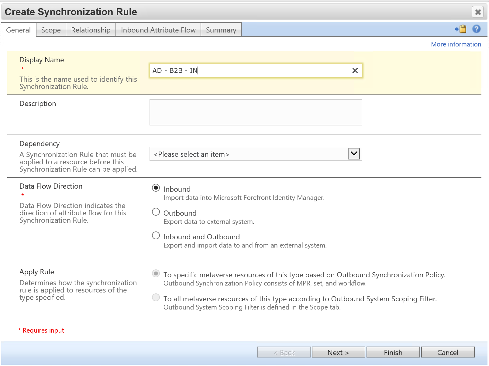
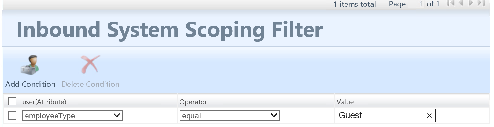
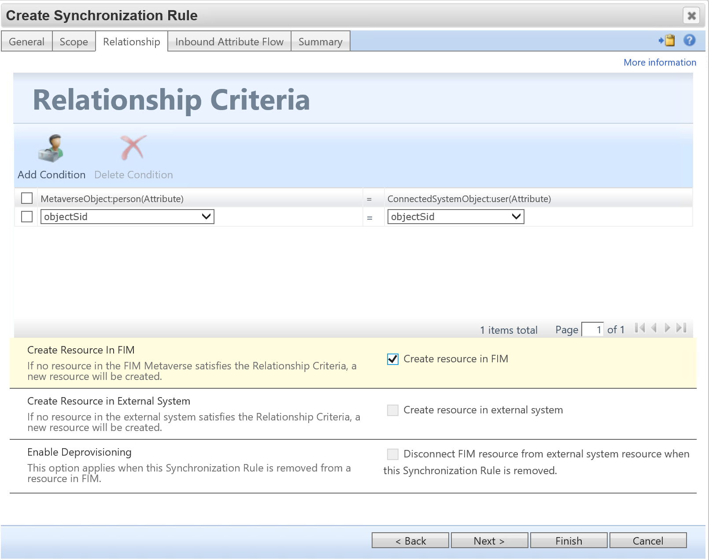
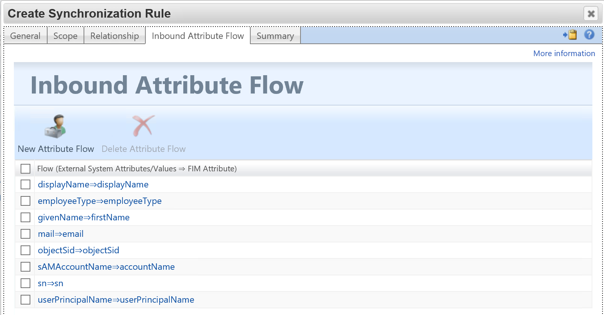

# Setup MIM for AAD Guest Accounts - Synchronization Rule 2

## Prerequisits
This chapter will create the synchronization rule for importing AD 'Guest' users.

You should have completed the following steps already:

- [Windows Server 2019 preparations](prepare-server-ws-2019.md)
- [SQL Server 2016/2017 setup](install-SQL-server.md)
- [MIM Synchronization Service](install-mim-sync-service.md)
- [The MIM synchronization MA](installing-MimMa.md) 
- [SharePoint](prepare-server-sharepoint.md)
- [MIM Service and Portal](install-mim-service-portal.md)
- [The Active Directory MA](installing-ADMA.md)

## Synchronization Rule 2: Import Active Directory Guest users
As users are added to Active Directory, these user objects will also have to be imported back into the metaverse. This ensures that the synchronization engine is up-to-date with the latest users in AD:

1. Select _Synchronization Rules_, and click **New**
2. Give the new rule a name (eg:AD-B2B-IN) 
3. Set the _Data Flow Direction_ to **Inbound** and click **Next**

4. On the _scope_ page, set the following information
> - Metaverse resource type: **Person**
> - External System: **ADMA**
> - External System Resource Type: **User**

5. Under _Inbound Scoping Filter_ select **employeeType** as the user(Attribute) then set the Operator to **equal** and set the value to _**Guest**_ and click **Next**

6. On the _relationship criteria_ page, set:
> - MetaverseObject:Person: **objectSID**
> - ConnectedSystemObject:user: **objectSID**
> - Select **Create a resource in FIM**

7. Click **Next**

8. For the _inbound attribute flow_, create the following attribute flows by:
> - Click **New Attribute Flow**
> - Select the _AD Source Attribute_ from the Source selection box
> - Click the **Destination** tab
> - Select the _FIM Destination Attribute_ from the drop down list
> - Click **OK**

> | AD Source Attribute | FIM Destination Attribute |
> |---------------------|:--------------------------:
> | userPrincipalName   |    userPrincipalName      |
> | displayName         |    displayName            |
> | sn                  |    sn                     |
> | mail                |    email                  |
> | givenName           |    firstName              |
> | employeeType        |    employeeType           |
> | objectSID           |    objectSID              |
> | sAMAccountName      |    accountName            |

9. Click **Next** and then click **Submit**

## Next: Configuring Synchronization Rules in the MIM Portal 
A number of rules will have to be created through the MIM portal, this includes importing users from AAD and AD and exporting users to AD:

- [Synchronization Rule 3: Create Guest User account in Active Directory](rule3-export-to-ad.md)

> - [Synchronization Rule 1: Import Guest User from Azure Active Directory](rule1-import-from-aad.md)
> - [Synchronization Rule 2: Import Active Directory Guest users](rule2-import-from-ad.md)