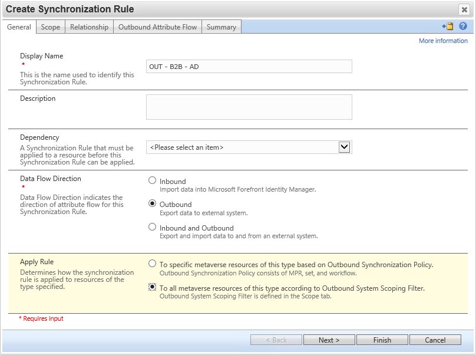
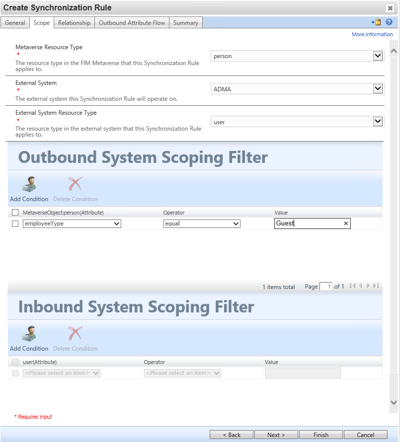
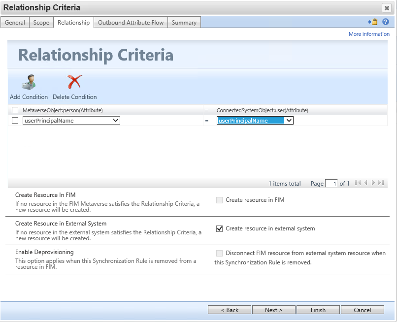
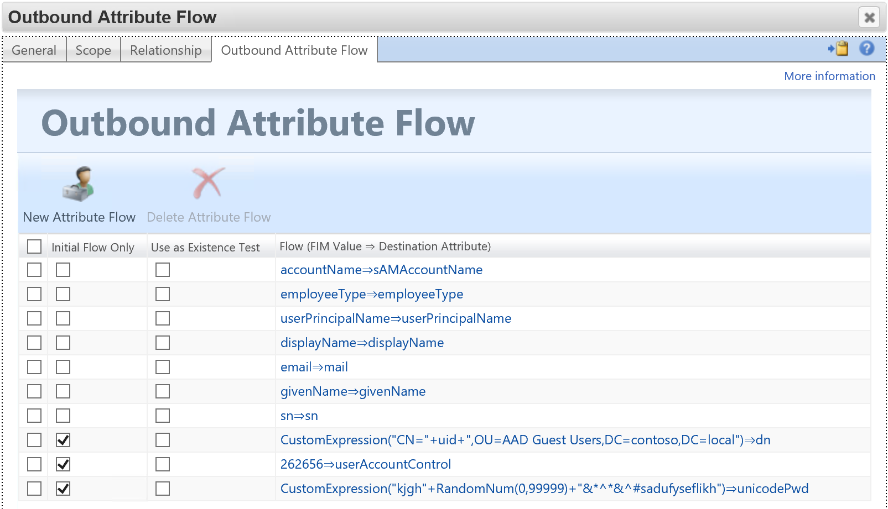

# Setup MIM for AAD Guest Accounts - Synchronization Rule 3

## Prerequisits
This chapter will create the synchronization rule for exporting AAD 'Guest' users to AD.

You should have completed the following steps already:

- [Windows Server 2019 preparations](prepare-server-ws-2019.md)
- [SQL Server 2016/2017 setup](install-SQL-server.md)
- [MIM Synchronization Service](install-mim-sync-service.md)
- [The MIM synchronization MA](installing-MimMa.md) 
- [SharePoint](prepare-server-sharepoint.md)
- [MIM Service and Portal](install-mim-service-portal.md)
- [The Active Directory MA](installing-ADMA.md)
- [The Graph API MA](installing-AADMA.md)

## Synchronization Rule 3: Export Active Directory Guest users
This rule will export the users from the metaverse to Active Directory. They will be added to a specified OU. 
> [!WARNING]
Be sure the flow for dn must place the user in the organizational unit which was excluded from Azure AD Connect.

> [!IMPORTANT]
Update the flow for unicodePwd to meet your AD password policy - the user will not need to know the password.

> [!TIP]
The value of 262656 for userAccountControl enables the SMARTCARD_REQUIRED and NORMAL_ACCOUNT attributes for the guest users ensuring they cannot 'interactively' login to any system for enhanced security.

## Creating Rule #3

1. In the MIM portal under Synchronization rules, click **New** to create a new rule
2. Provide a name for the rule (eg: AD – B2B – OUT) and select **Outbound** for the Data Flow Direction and select **To all metaverse resources of this type...** then click **Next**

  
3. On the _Scope_ page, select the following items: 
> - Metaverse Resource Type: **person**
> - External System: **ADMA**
> - External System Resource Type: **user**

4.	On the _Outbound System Scoping_ set the condition to:
> - **MetaverseObject:Person: employeeType**
> - Operator: **Equal**
> - Value: **Guest**

5.	Click **Next**
  
6.	On the _Relationship criteria_ page set
> - MetaverseObject:Person: **userPrincipalName** 
> - ConnectedSystemObject:user: **userPrincipalName**
7.	select **Create Resource in External System** and click **Next**
  

On the outbound attribute flow page we create the mappings for the attributes for the to-be created object in AD. The following mappings will need to be made. While most of them are 1:1 mappings, three of them are not:
> - The CN should be created based on the uid of the user in a distinguishedName format to put the user as a unique user in the right OU. 
> - The password is in this example is a random 3 digit number and the userPrincipalName (we could add a special character if required by the password policies).
> - The user account control mandates users must use a (non-existing) smartcard for interactive logins. This ensures that even if a user knows their password, they can’t use it to interactively login to a system. For this,

8. On the _Outbound attribute flow_ page, click **New attribute flow**
9.	For the value select **Custom Expression** under **Advanced**. Type **“CN=” + uid + “,`<distinguishedNametoOU>`”** 

> [!IMPORTANT]
For example: "CN=" + uid + ",OU=AAD Guest Users,DC=contoso,DC=local"

10.	click **Destination** and select **dn** for the destination attribute and click **OK**
11. Select **Initial Flow Only** on the _Outbound Attribute Flow_ Page for the created rule
12. click **New Attribute Flow**, select **custom expression** under **Advanced** 
13.	Type: **"kjgh"+RandomNum(0,99999)+"&*^*&^#sadufyseflikh"** and click **Destination**, select **unicodePwd** and click **OK**

> [!IMPORTANT]
Change the randon characters to ensure you have a unique password prefix and postfix for your implementation -the user doesn’t need to know / remember the password.

14.	Select **Initial Flow Only** on the Outbound Attribute Flow Page for the created rule
15.	click **New Attribute Flow**, select **Number** under **Constant Value**
16.	Under the number entry, type **262656** and click **Destination**. Then select **userAccountControl** and click **OK**
17.	Select **Initial Flow Only** on the Outbound Attribute Flow Page for the created rule
18.	Add the following direct mappings by clicking **New Attribute Flow** select the _MIMSource_ for the source attribute from the list below, select **Destination** and select the _AD destination attribute_ as per below

> | MIM Source        | AD Destination Attribute | Options |
> |-------------------|:-------------------------| --------: 
> | accountName       |	sAMAccountName	         | |
> | givenName         | givenName	| Allow Null value |
> | eMail             |	mail	Allow Null |
> | sn                | sn |	Allow Null value |
> | userPrincipalName | userPrincipalName	| |
> | displayName       |	displayName	|Allow Null value |
> | employeeType      |	employeeType	||

19.	Click **Next** and click **Submit** to create the rule.

This concludes the creation of the rules.

## Next: Running initial Synchronizations 
All the rules have been added now, and we can continue with the initial import of AAD Guest users into the metaverse and then exporting them to AD.

- [Run the synchronization rules](run-sync-rules.md)
