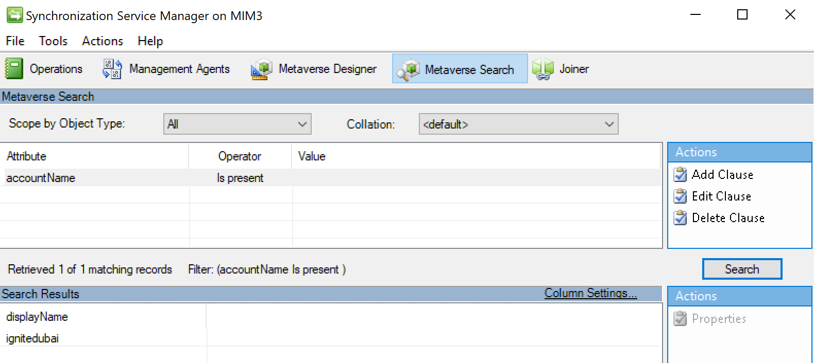
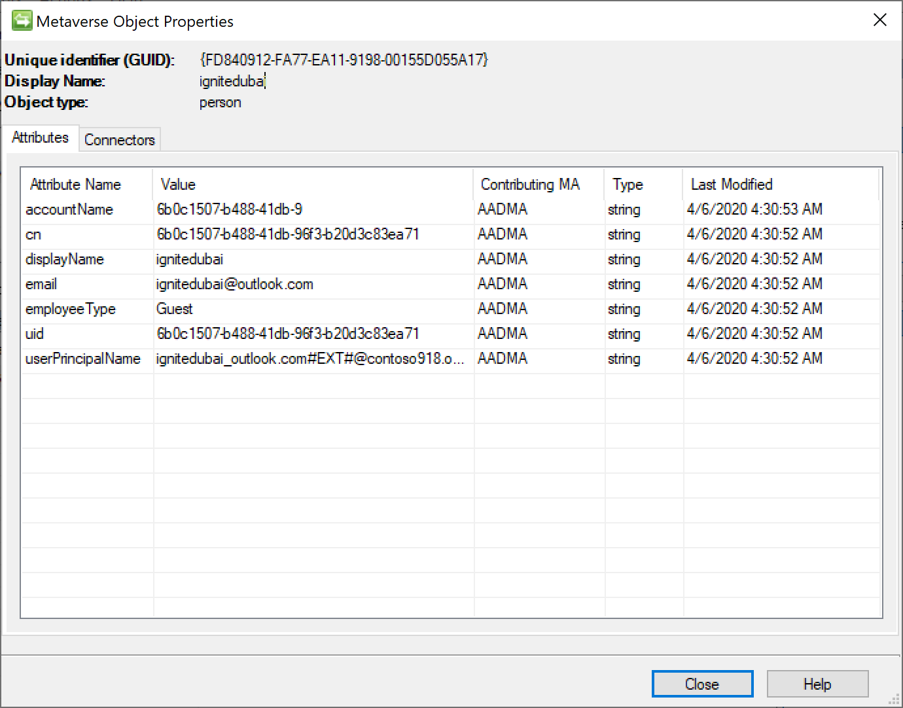

# Setup MIM for AAD Guest Accounts - Run the synchronization rules

## Prerequisits
This chapter will create the synchronization rule for exporting AAD 'Guest' users to AD.

You should have completed the following steps already:

- [Windows Server 2019 preparations](prepare-server-ws-2019.md)
- [SQL Server 2016/2017 setup](install-SQL-server.md)
- [MIM Synchronization Service](install-mim-sync-service.md)
- [The MIM synchronization MA](installing-MimMa.md) 
- [SharePoint](prepare-server-sharepoint.md)
- [MIM Service and Portal](install-mim-service-portal.md)
- [The Active Directory MA](installing-ADMA.md)
- [The Graph API MA](installing-AADMA.md)
- [Configuring Run Profiles](configuring-MA-runprofiles.md)
- [Synchronization Rule 1: Import Guest User from Azure Active Directory](rule1-import-from-aad.md)
- [Synchronization Rule 2: Import Active Directory Guest users](rule2-import-from-ad.md)
- [Synchronization Rule 3: Create Guest User account in Active Directory](rule3-export-to-ad.md)

## Importing the created flow rules
The rules that are created in earlier in the portal need to be imported into the Synchronization Service. For this, we run the import and synchronization on the FIM/MIM Management Agent:

1. Go to the Management Agents tab on the Synchronization Service Console
2. Right click the MIMMA (FIM Service Management Agent) and click **Run**
3. Select **Full Import (Stage Only)**
You should see 3 Adds under the Synchronization Statistics
 
4. Next, right click the MIMMA (FIM Service Management Agent), select **Run**
5. Select the **Full Synchronization** and click **OK**

The rules are now imported into the system

## Importing from Azure AD to the Metaverse
As we have a guest user in AAD, we can run the Import on the AADMA:

1. Open Synchronization Service Manager
2. Go to the **Management Agents** tab 
3. Right click AADMA (Graph (Microsoft)) and click **Run**
4. Select **Full Import (Stage Only)**

>_You should see Adds in the statistics window_

5. Right click AADMA (Graph (Microsoft)) and click **Run**
6. Select **Full Synchronization**

> _You should see projections in the statistics window_

## Validating imported users
This step is optional and would not be required at every run. and is to validate if the users are imported correctly into the system
1. Open Synchronization Service Manager
2. Go to the **Metaverse Search** tab 
3. Under **Actions**, click **Add Clause**
4. Under **attribute**, select **accountName**
5. For operator select: **Is Present**
6. Click **Search**
7. The system should show you the Guest accounts

8. Click the showed displayName entry and select **Properties**
9. A pop-up will be shown with the details of this user in the database

## Creating AD users
To export the Guest users in the database to Active Directory, the ADMA Management Adapter needs to be run:
1. Open Synchronization Service Manager
2. Go to the **Management Agents** tab
3. Right click ADMA (Graph (Microsoft)) and click **Run**
4. Select **Full Import (Stage Only)**
You should see new Adds in the statistics window
5. Right click ADMA (Graph (Microsoft)) and click **Run**
6. Select **Full Synchronization**
7. Right click ADMA (Graph (Microsoft)) and click **Run**
8. Select **Export**
You should see exported objects and newly created users in AD

## Next: Scheduling autoruns 
All the rules have been added now, and we can continue with the initial import of AAD Guest users into the metaverse and then exporting them to AD.

- [Automate the synchronization runs](schedule-sync-runs.md)
